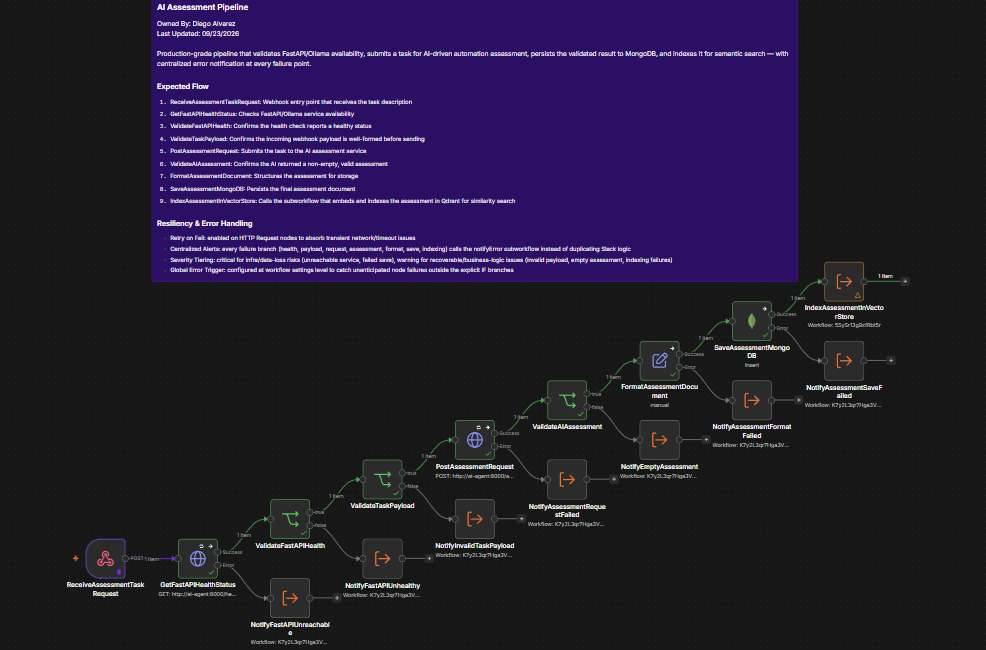
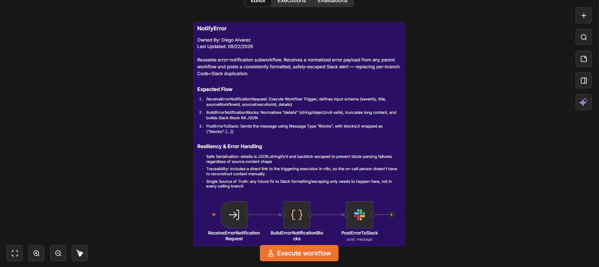
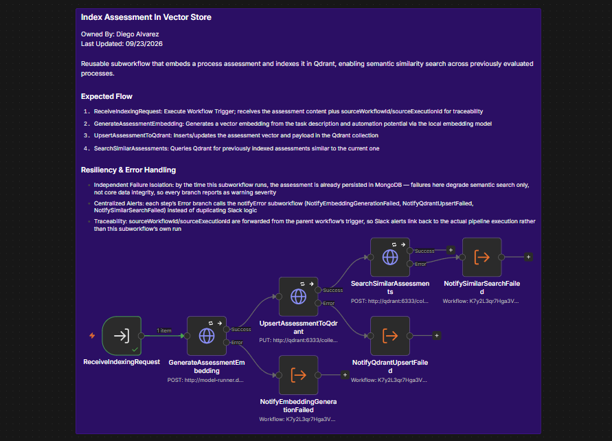

# Process Intelligence Pipeline (FastAPI + n8n + MongoDB + Qdrant)





Production-ready Python AI Agent service built with FastAPI, Docker, and Docker Model Runner. It processes structured process analysis tasks using local LLM inference (`ai/smollm2`), enforces strict JSON response validation using Pydantic, and provides hot-reload capabilities for rapid containerized development.

## Table of Contents

- [Business Problem](#business-problem)
- [Key Architectural Features](#key-architectural-features)
- [Orchestration & Resilience Architecture (n8n)](#orchestration--resilience-architecture-n8n)
- [Architecture & Stack](#architecture--stack)
- [Repository Structure](#repository-structure)
- [Environment Variables](#environment-variables)
- [How to Setup and Run](#how-to-setup-and-run)
- [Orchestrator Configuration (n8n Setup)](#orchestrator-configuration-n8n-setup)
- [Testing](#testing)
- [Technical Notes](#technical-notes)
- [License](#license)
- [Contributing](#contributing)

## Business Problem

Modern enterprise automation pipelines need local or air-gapped AI processing to analyze operational tasks without exposing sensitive data to external cloud APIs or introducing high API operational costs. Standard LLM integration approaches often suffer from unstructured, unpredictable text outputs that break downstream software systems and lack standardized containerization.

This architecture addresses:
* **Data Privacy & Cost Control:** Eliminates external cloud dependencies by hosting lightweight instruction-tuned LLMs locally inside Docker.
* **Unstructured Response Failures:** Forces strict JSON output schemas with Pydantic validation to prevent downstream parsing errors.
* **Deployment Inconsistency:** Enforces container-level environment isolation, ensuring identical execution across local development and production servers.

## Key Architectural Features

### 1. Production FastAPI Architecture
* **Structured Request/Response Schemas:** Utilizes Pydantic models (`AgentRequest`, `AgentAnalysisResponse`) with field validation and automatic OpenAPI documentation.
* **Determined System Prompts:** Implements system-level role conditioning and low inference temperature (`0.2`) for deterministic and repeatable structured analysis.
* **Robust Error Handling:** Encapsulates local model runner connection states with specific HTTP exceptions and stacktrace chaining.

## Orchestration & Resilience Architecture (n8n)

The pipeline uses **n8n** to coordinate the ingestion, validation, AI evaluation, persistent auditing, and failure notification:

1. **Main Assessment Workflow (`workflows/ai-assessment-pipeline.json`):**
   - **Webhook-Driven Trigger:** Entry point receives the task description directly via webhook, replacing manual payload entry used during development.
   - **Healthcheck & Pre-validation:** Verifies FastAPI service availability and validates the incoming webhook payload structure before triggering LLM inference.
   - **AI Analysis Execution:** Calls the local FastAPI endpoint to perform structured process feasibility analysis.
   - **Data Normalization & Audit Storage:** Sanitizes the output and persists evaluation logs directly into **MongoDB**.
   - **Semantic Indexing:** On successful save, delegates to the `Index Assessment In Vector Store` subworkflow to embed and index the assessment for future similarity search.

2. **Vector Indexing Subworkflow (`workflows/index-assessment-in-vector-store.json`):**
   - **Embedding Generation:** Generates a vector embedding from the assessment's task description and automation potential via the local embedding model.
   - **Qdrant Upsert:** Inserts/updates the assessment vector and payload in the Qdrant collection.
   - **Similarity Search:** Queries Qdrant for previously indexed assessments similar to the current one.
   - **Isolated Failure Severity:** Since the assessment is already persisted in MongoDB by the time this subworkflow runs, failures here degrade semantic search only — not core data integrity — so every branch reports as `warning` severity to `notifyError`.

3. **Error Handling Strategy (System Settings + Subworkflow):**
   - **Global Error Workflow:** Linked via n8n Workflow Settings to automatically catch unhandled system exceptions and execution failures across the main pipeline.
   - **Centralized Error Subworkflow (`workflows/notify-error.json`):** Formats error context and generates rich Slack alerts using Block Kit layout, complete with node details and direct links to the n8n execution log for rapid debugging.
   - **Resilient HTTP Calls:** Retry-on-fail enabled on all outbound HTTP nodes to absorb transient network or timeout issues without triggering false-positive alerts.
   - **Severity-Tiered Alerting:** Failures are classified as `critical` (service unreachable, data-loss risk on save) or `warning` (recoverable business-logic issues, e.g. invalid payload, empty AI response, or indexing failures), so on-call response is proportional to actual risk.

### 2. Docker & Local LLM Runtime Integration

* **Docker Model Runner Integration:** Connects directly to local Docker LLM engines using Docker internal DNS (`model-runner.docker.internal`).
* **Environment-Driven Configuration:** Separates runtime behavior using `.env` files with defensive fallback values across all service endpoints.
* **Live-Reload Development Loop:** Integrates Docker bind mounts to reflect Python code changes in real time without container rebuilds.

## Architecture & Stack

* **Python 3.13+ & FastAPI:** Core LLM assessment microservice & data validation
* **n8n:** Workflow orchestration & business process automation
* **MongoDB:** Document store for historical process evaluation audits
* **Qdrant:** Vector database for semantic similarity search across indexed assessments — see [index-assessment-in-vector-store.json](workflows/index-assessment-in-vector-store.json)
* **Slack API (Block Kit):** Real-time alerting & centralized subworkflow error management — see [notify-error.json](workflows/notify-error.json)
* **Docker & Docker Compose:** Container orchestration & environment isolation
* **Docker Model Runner / OpenAI SDK:** Local LLM inference engine (`ai/smollm2`)
* **Pydantic v2:** Data validation and JSON schema enforcement

## Repository Structure

```text
.
├── app/
│   ├── __init__.py
│   └── main.py          # FastAPI application & AI Agent endpoints
├── assets/              # Workflow diagrams & architecture screenshots
│   ├── ai_assessment_pipeline_main.png
│   ├── index_assessment_in_vector_store_subworkflow.png
│   └── notify_error_subworkflow.png
├── tests/
│   └── test_main.py     # Unit tests for the FastAPI application
├── workflows/           # Exported n8n workflows (JSON)
│   ├── ai-assessment-pipeline.json
│   ├── index-assessment-in-vector-store.json
│   └── notify-error.json
├── .dockerignore
├── .env.example         # Environment template for repository setup
├── .gitignore
├── docker-compose.yaml  # Docker Compose service specification
├── Dockerfile           # Python container image build instructions
├── README.md            # Project documentation
└── requirements.txt     # Python dependencies

```

## Environment Variables

This project uses a `.env` file (see `.env.example`) to configure the FastAPI service:

| Variable | Description | Example |
|---|---|---|
| `APP_ENV` | Runtime environment mode (affects logging/debug behavior) | `development` |
| `LLM_MODEL` | Docker Model Runner model identifier to use for inference | `ai/smollm2` |
| `LLM_URL` | Docker Model Runner internal API endpoint (OpenAI-compatible) | `http://model-runner.docker.internal/v1/` |
| `LLM_TIMEOUT` | Max seconds to wait for the local LLM to respond before failing the request with a 500; increase on slower hardware, decrease for faster failover | `60.0` |
| `API_KEY` | API key for the LLM endpoint; not required for local Docker Model Runner | `not-needed` |
| `WEBHOOK_URL` | Base URL for the n8n container (`N8N_EDITOR_BASE_URL`/`WEBHOOK_URL`), used only by n8n — not read by the FastAPI app — to correctly build direct execution links (`/workflow/.../executions/...`) sent by the `notifyError` subworkflow to Slack | `http://localhost:5678` |

> **Note:** MongoDB, Qdrant, and Slack credentials are configured directly in n8n's credential manager, not in this repository's `.env` file, since persistence, indexing, and alerting are handled by the orchestration layer.

## How to Setup and Run

To run this AI Agent service in your local Docker environment:

1. **Clone the repository:**
```bash
git clone https://github.com/dear28/process-intelligence-pipeline.git
cd process-intelligence-pipeline
```
2. **Configure Environment Variables:**
Copy the example environment template:
```bash
cp .env.example .env
```
3. **Enable and Pull the Local LLM Model:**
Ensure Docker Model Runner is enabled in Docker Desktop, then pull the target model:
```bash
docker model pull ai/smollm2
```
4. **Build and Start All Containers:**
Launch the complete multi-container stack (`ai-agent`, `n8n`, `mongodb`, `qdrant`) in detached mode:
```bash
docker compose up --build -d
```
5. **Verify Running Containers:**
Ensure all four services report a `running` or `healthy` state:
```bash
docker compose ps
```
5. **Verify and Test API:**
Navigate to the Swagger UI interactive documentation at [http://localhost:8000/docs](http://localhost:8000/docs) and test the POST /analyze endpoint with a custom prompt payload.

> The n8n editor is available at [http://localhost:5678](http://localhost:5678) (default `WEBHOOK_URL`). See [Orchestrator Configuration](#orchestrator-configuration-n8n-setup) below to import the workflows and configure credentials before triggering the pipeline end to end.

## Orchestrator Configuration (n8n Setup)

1. **Access n8n Interface:**
Open [http://localhost:5678](http://localhost:5678) in your web browser and complete the initial account setup.

2. **Configure Credentials in n8n:**
Navigate to **Settings > Credentials** and add:
   - **MongoDB:** Connection string pointing to `mongodb://mongodb:27017`
   - **Slack API:** Bot Token credential for dispatching alert messages

   > Qdrant is called directly via HTTP Request nodes (no dedicated n8n credential needed) using the internal Docker DNS endpoint `http://qdrant:6333`.

3. **Import Workflows into n8n:**
Go to **Workflows > Import from File** and upload the JSON files from the `workflows/` directory in this exact order (subworkflows must exist before the workflow that calls them):
   ```
   a. workflows/notify-error.json                        (Error handling subworkflow)
   b. workflows/index-assessment-in-vector-store.json     (Vector search subworkflow)
   c. workflows/ai-assessment-pipeline.json               (Main assessment pipeline)
   ```

4. **Link Error Handling & Activate Workflows:**
   - Open **AI Assessment Pipeline**, go to **Workflow Settings**, and set **Error Workflow** to `notifyError`.
   - Switch the **Active** toggle to **ON** for all three workflows: `AI Assessment Pipeline`, `Index Assessment In Vector Store`, and `notifyError`.

   > n8n requires a workflow to be Active before it can be invoked by an `Execute Workflow` node — even subworkflows that only start with an Execute Workflow Trigger and have no webhook of their own. Since both `Index Assessment In Vector Store` and `notifyError` are called this way from the main pipeline, skipping this step for either one will cause that branch to fail silently at runtime.

## Testing

### Unit Tests (FastAPI)

Unit tests for the FastAPI application live in `tests/test_main.py`. Run them with:

```bash
pip install -r requirements.txt
pytest tests/
```

> Adjust the command above if the project uses a different test runner or a `requirements-dev.txt` for test-only dependencies.

### End-to-End Pipeline Test (n8n Webhook)

Once the workflows are imported, credentials configured, and all three activated (see [Orchestrator Configuration](#orchestrator-configuration-n8n-setup)), trigger a full run through the live webhook:

1. **Trigger an Assessment via Webhook:**
Send a POST request with an operational process description to the active n8n webhook endpoint:
```bash
curl -X POST http://localhost:5678/webhook/process-assessment \
  -H "Content-Type: application/json" \
  -d '{
    "task_description": "Manual extraction of line items from PDF invoices into ERP software daily and sending validation emails."
  }'
```

2. **Inspect Application Dashboards:**
   - **n8n Executions:** Review the full visual trace across FastAPI evaluation, MongoDB persistence, and Qdrant indexing.
   - **FastAPI Swagger Docs:** Test the standalone REST API at [http://localhost:8000/docs](http://localhost:8000/docs).
   - **Qdrant Vector Dashboard:** Inspect indexed collection points at [http://localhost:6333/dashboard](http://localhost:6333/dashboard).

## Technical Notes

* JSON Output Enforcement: The SYSTEM_PROMPT enforces raw JSON output without markdown codeblocks, validated immediately via AgentAnalysisResponse.model_validate_json().
* Container Isolation: Dependencies and standard OpenAI API bindings are locked inside the container, avoiding local Python version conflicts.